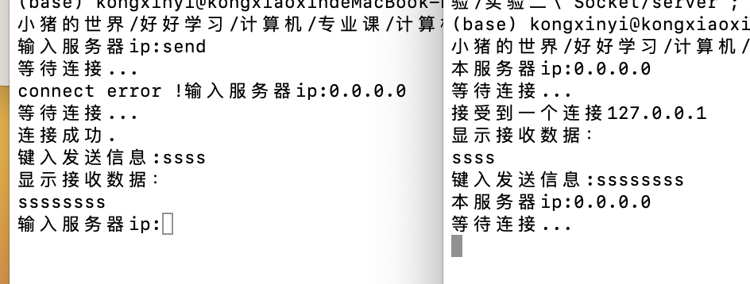

# 用户手册&验收
## 作业要求
客户端应有图形界面，便于发送和接收数据；

可以满足3个以上的客户端同时接入系统，并且任意客户端之间可以同时进行全双工通信。

用户需登录服务端。
## 提交附件形式或readme目录:
- 系统概述:运行环境、编译、使用方法、实现环境、程序文件列表等; 
- 主要数据结构;  **见tips.md**
- 主要算法描述;  **见tips.md or 程序注释 & 项目报告**
- 用户使用手册;  
- 程序源代码;

## 系统概述
### 运行环境
**操作系统**：Linux 或 macOS 系统。

**编译器**：支持C++11或更高版本的编译器，如GCC或Clang。

**Qt 版本**：Qt5及以上版本，用于实现图形界面和网络通信。

**其他库**：Pthread库用于多线程通信。

### 编译
1. cpp底层逻辑可以使用任何cpp编译器编译形成可执行文件;
2. QT Creator开发：项目使用CMake进行编译和构建，支持Qt自动化生成文件。

安装CMake和Qt5开发环境。
在项目根目录下运行以下命令：
``` bash
mkdir build && cd build
cmake ..
make
```
编译成功后会生成两个可执行文件server和client。

### 使用方法
#### 1. cpp底层逻辑实现可执行文件
双击打开`server`和`client`的可执行文件
在客户端输入服务器IP后两边即可双向通行

#### 2. QT Crator开发的有界面的可执行文件
双击打开cmake编译或者Qt creator编译形成的有界面的`server`和`client`的可执行文件：

**服务器** 
创建时可输入ip和端口号开始监听

几个窗口分别是接受消息，广播给客户端消息，右下角的框为一个可以实时查看客户端登录情况的消息框

状态框可以看到实时状态（如接受消息和断开连接）和各种error报错

关闭服务器按钮将退出


**客户端**
输入用户名 连接服务器ip和端口后连接，可以进行双向通行
几个窗口分别是接受消息，发送服务器消息，

状态框可以看到实时状态（如接受消息和断开连接）和各种error报错

断开连接可以连接其他服务器


### 实现环境
编译器：GCC 9.4.0 / Clang 12.0.0

Qt5版本：5.15

Pthread库：用于实现多线程处理。

### 程序文件列表
#### QTcreator + cpp
- CMakeLists.txt：CMake配置文件，用于构建项目。
- main.cpp：服务器界面主程序入口。
- server.cpp/server.h：服务器端处理逻辑
- server.ui:界面设计

（client也是这样）

#### cpp
- server.cpp 服务器端
- client.cpp 客户端

#### md文件
- readme.md 记录验收和项目环境 程序列表 用户使用手册
- tips.md 记录知识点